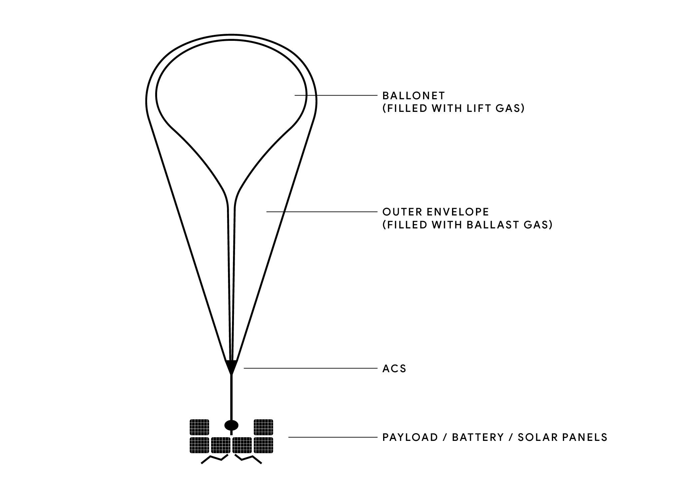
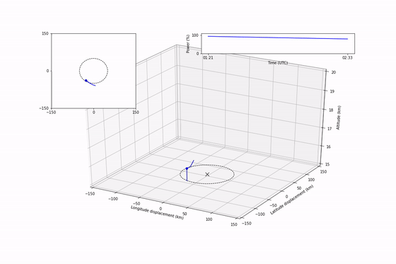

About the Balloon Learning Environment
======================================

This page gives a simple background into the problem of flying
stratospheric balloons and station keeping. This is intended to
be an introduction, and doesn't discuss all the nuances of the simulator
or real-world complexities.

Stratospheric Balloons
######################

The type of balloon that we consider in the BLE is pictured below.
These balloons have an outer envelope and an inner envelope (ballonet).
The ballonet is filled with a buoyant gas (for example, helium).
The outer envelope contains air which acts as ballast.
An Altitude Control System (ACS) is able to pump air in or out of the envelope.
When air is pumped into the balloon the average density
of the gases in the envelope increases, which in turn makes the balloon
descend. On the other hand, if air is pumped out of the balloon then the
average gas density decreases, resulting in the balloon ascending.

The balloons are also equipped with a battery to power the ACS, and solar
panels to recharge the batteries. Power is used by communication systems
on the balloon, so battery power is constantly draining when the solar panels
aren't in use. This means that the balloons in the BLE are constrained at
night—they cannot constantly use the ACS without running out of power.
The energy required for running the ACS is asymmetric;
the energy needed to release air from the envelope (ascend) is negligable.

Navigating a Windfield
######################

The balloons in the BLE have no way of moving themselves laterally. They
are only capable of moving up, down, or staying at the current altitude.
To navigate they must "surf" the wind to get where they need to go. The
balloons are flown in a 4d windfield, where each different x, y, altitude, time
position gives a different wind vector. A balloon must learn how to navigate
this windfield to achieve its goal.

.. image:: imgs/wind_field.gif

Station-Keeping
###############

The goal of station-keeping is to remain within a fixed distance of a
ground station. This distance is only measured in the x, y plane, i.e. the
altitude of the balloon is not taken into account. In the BLE, the task
is to keep a balloon within 50km of the ground station. We call the proportion
of time that a balloon remains within 50km of the ground station TWR50 (for
Time Within a Radius of 50km). In the BLE, each episode lasts two days.

Failure Modes
#############

A balloon can have a critical failure by running out of power, flying too low,
or having a superpressure that is too high or too low.
Each of these are partially protected by a
safety layer, but in extreme conditions there can still be critical failures.
